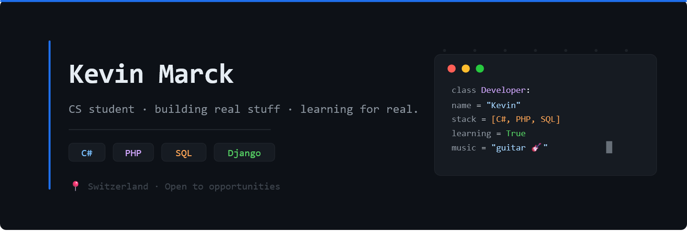

---

### About me

I'm a first-year CS student in Switzerland, currently doing an internship as a backend developer. I spend most of my time building APIs, fixing things I broke five minutes ago, and figuring out how real-world software actually works outside of a classroom.

I write clean code (or at least I try). I care about building things that make sense — not just things that run.

When I'm not coding, I play guitar and sing. Balance is real.

---

### Tech stack

<!-- skillicons.dev auto-generates the icon row below. No changes needed. -->

| Language / Tool | Level |
|---|---|
| C# | ~4 years |
| PHP | ~3 years |
| SQL | ~3 years |
| HTML / CSS / JS | ~4 years |
| Django / DRF | Currently using at work |
| Python | Just getting started |

---

### Featured projects

> *Check the pinned repos below for the full picture.*

**[school-labs](https://github.com/Mrck-Kvs/school-labs)** — C# and WPF
exercises from my first-year CS program. Learning in public.
<!--
**[HairLab](#)** — Mobile booking app for hair salons. React Native + Node.js/TypeScript, built with Supabase and OTP auth. Full-stack from scratch.
-->
---

### GitHub stats

  
  

---

### Currently

- Building a REST API from a legacy Django monolith (internship)
- Getting more comfortable with Python and the Django ecosystem
- Playing guitar when the bugs get too annoying

---

*Open to feedback. Always learning.*

